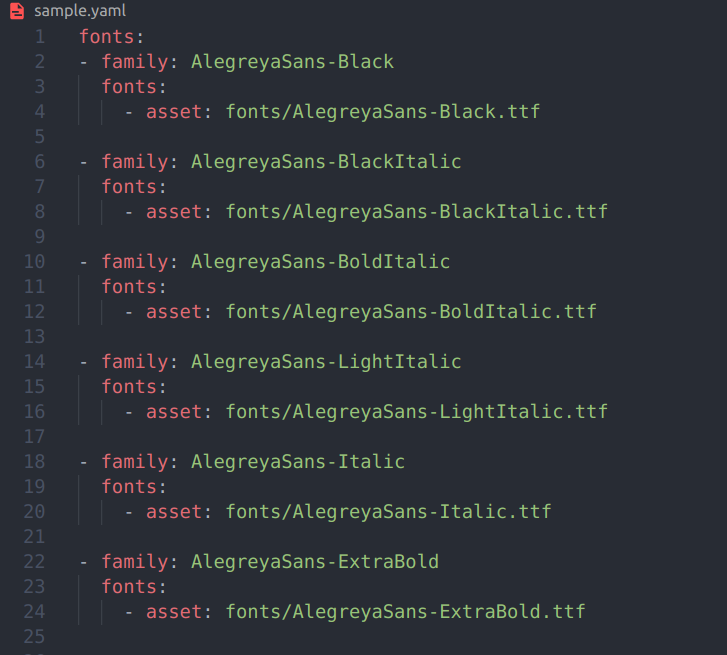

# Font Pubspec Generator

Adding individual custom font in pubspec.yaml is tiresome. So here is a simple script to solve that problem.

## How to Use

It assumes that, all of your fonts(.ttf) files are in a same directory name as "fonts".

```
python3 main.py --path <path_to_your_font_folder>
```

## Sample Usage

```
python3 main.py --path /home/gymy/Downloads/Alegreya_Sans
```

#### Output
